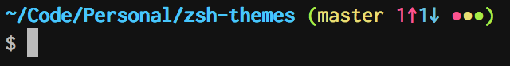
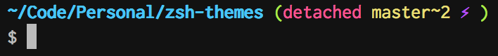
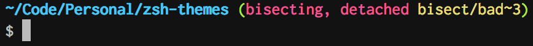

# Minimal, fast zsh themes

TODO screenshot


## Overview

* Shows username and hostname, but only when you're not on your usual machine
* Shows working directory with interleaved git state
* Intelligently shortens long working directories
* Shows return value after commands that return an error code
* Shows number of background jobs
* Shows execution time after long-running commands
* Shows current Python virtualenv
* Optional asynchronous mode for faster prompts inside git repos


### Git integration
The basics from left to right: branch (master), number of commits ahead (1↑), number of commits behind (1↓), indicators for untracked/modified/staged.



Detached head warning, non-head-branch (master\~2), active merge/rebase indicator (⚡︎).



Bisecting:



Submodules or nested repos:


## Installation

### For [zgen](https://github.com/tarjoilija/zgen) users
Add this to your `~/.zshrc` with your other plugins, after loading oh-my-zsh:

```zsh
  zgen load mafredri/zsh-async
  zgen load mje-nz/zsh-themes async
  # or to disable asynchronous mode
  zgen load mje-nz/zsh-themes simple
```

### For [antigen](https://github.com/zsh-users/antigen) users (untested)
Add this to your `~/.zshrc` somewhere after loading oh-my-zsh:

```zsh
antigen bundle mafredri/zsh-async
antigen theme https://github.com/mje-nz/zsh-themes async
```

### For [zplug](https://github.com/zplug/zplug) users (untested)
Add this to your `~/.zshrc` with your other plugins:

```zsh
zplug mafredri/zsh-async, from:github
setopt prompt_subst
zplug "mje-nz/zsh-themes", use:async.zsh-theme, defer:3
```


## Configuration
See the top of `src/prompt_common.zsh` for configuration variables; to change them, export them in your `.zshrc`.
